# Guia de Usuario — Plan Master (Cascada de Produccion)

Documento para el usuario final del sistema. Explica como funciona el planificador de produccion, el orden correcto de configuracion y uso, y los puntos de decision clave.

---

## Flujo General

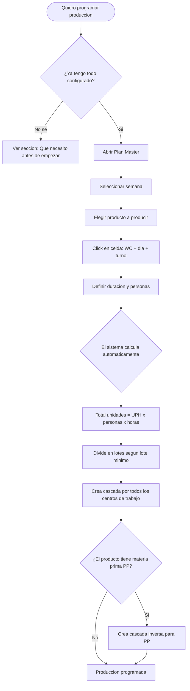

---

## Que necesito antes de empezar

Antes de poder programar produccion, estos datos deben estar configurados **en este orden**:

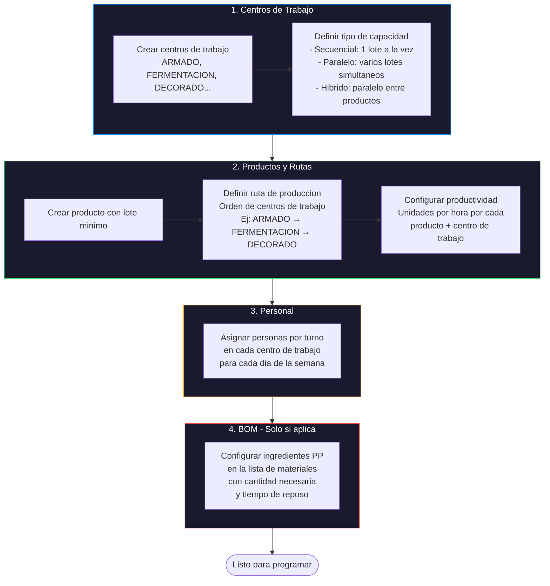

### Detalle de cada prerequisito

| # | Configuracion | Donde | Obligatorio | Que pasa si falta |
|---|--------------|-------|-------------|-------------------|
| 1 | Centros de trabajo | Produccion → Config | Si | No aparecen filas en el grid |
| 2 | Ruta de produccion | Produccion → Rutas | Si | Cascada no se puede crear |
| 3 | Productividad (UPH) | Produccion → Productividad | Si | Error al crear cascada |
| 4 | Lote minimo | Productos → Editar | Si | No sabe como dividir lotes |
| 5 | Personal por turno | Plan Master → Fila "Personas" | Recomendado | Asume 1 persona (mas lento) |
| 6 | BOM con PP | Produccion → BOM | Solo si hay PP | No crea cascada inversa |
| 7 | Bloqueo de turnos | Plan Master → Click en turno | Opcional | Todos los turnos disponibles |

---

## Sistema de Turnos

La semana de produccion NO es igual a la semana calendario.

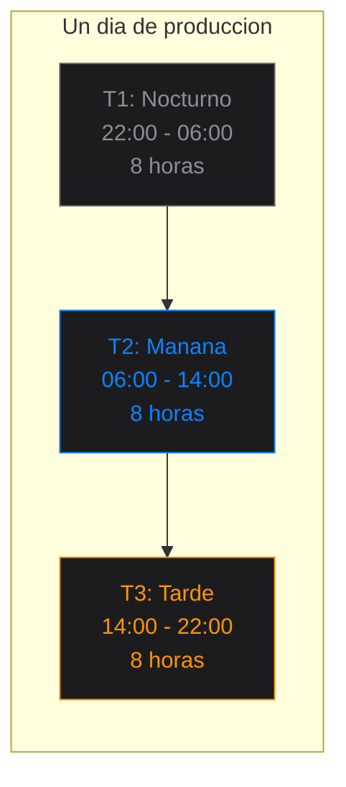

> **Importante**: El turno T1 (22:00) del sabado pertenece al **domingo** en el grid.
> La semana de produccion empieza el **sabado a las 22:00** y termina el siguiente sabado a las 22:00.

---

## Como se calcula la produccion

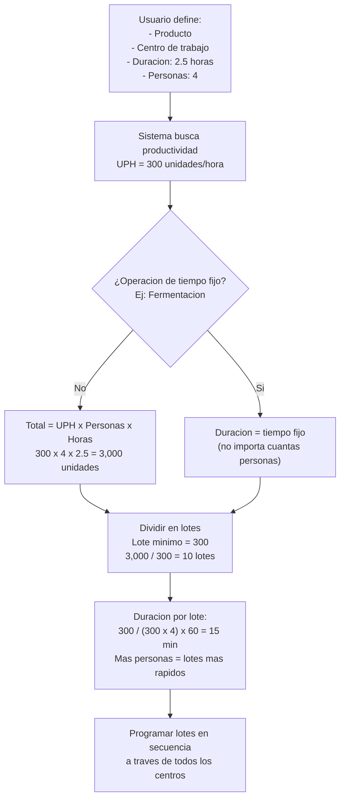

### Efecto del personal

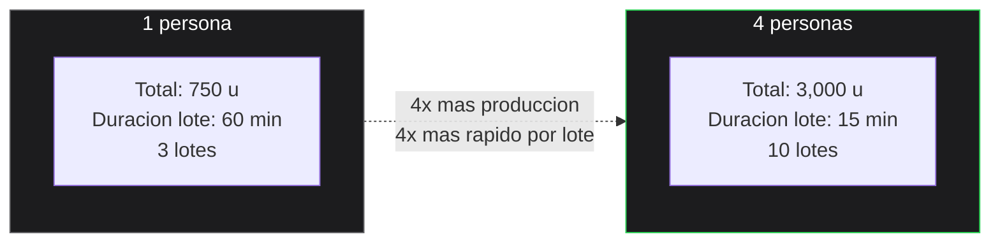

> **Excepcion**: Operaciones con **tiempo fijo** (como fermentacion u horneado) NO se aceleran con mas personas. El tiempo es siempre el mismo sin importar el personal.

---

## Tipos de Centro de Trabajo

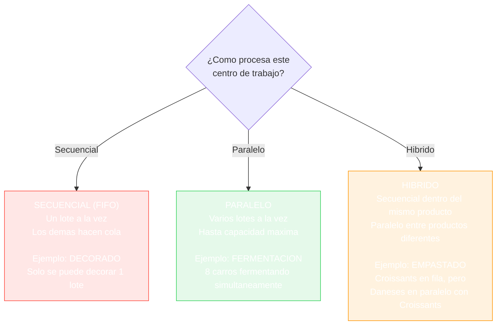

---

## Cascada Forward vs Backward

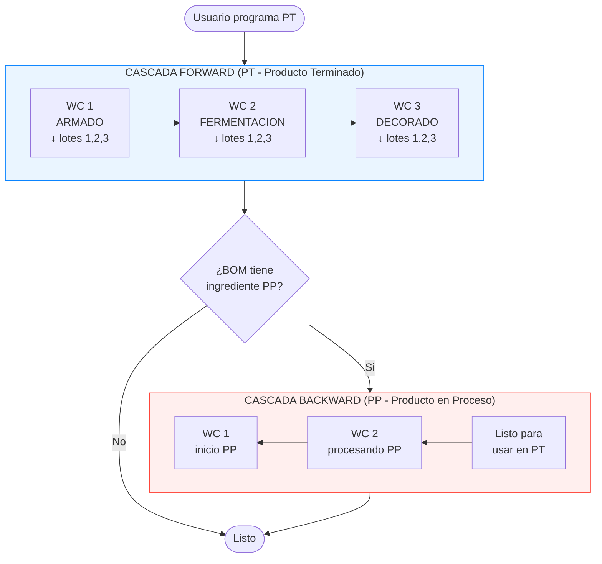

### Sincronizacion PT ↔ PP

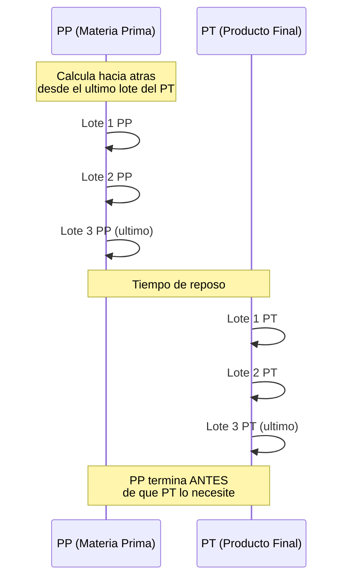

> **Regla de oro**: El ultimo lote del PP debe terminar antes del ultimo lote del PT, con el tiempo de reposo de por medio.

---

## Bloqueo de Turnos

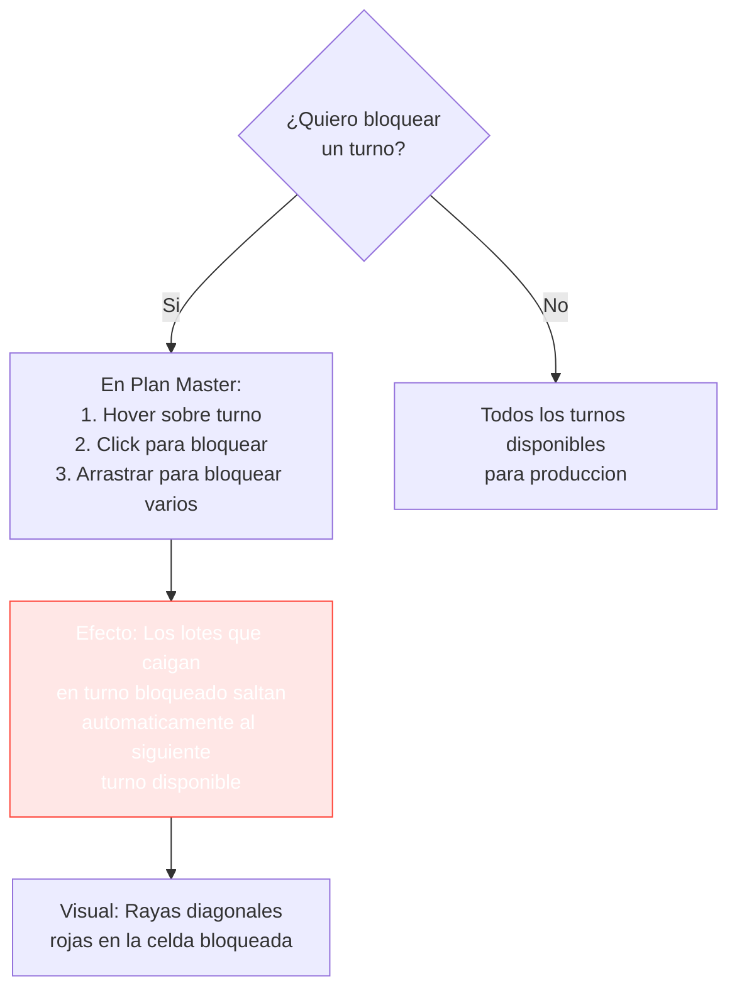

> **Importante**: Bloquear turnos ANTES de crear la cascada. El sistema respeta los bloqueos al momento de crear.

---

## Arbol de Decision: Crear Produccion

Cuando el usuario hace click en una celda para programar:

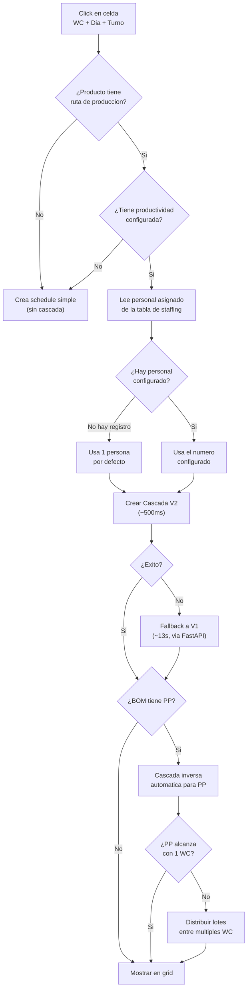

---

## Distribucion Multi-Centro de Trabajo

Solo aplica para PP cuando no alcanza el tiempo:

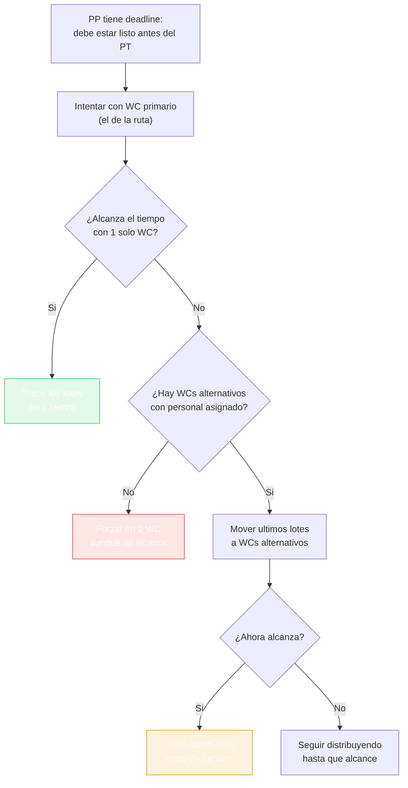

---

## Problemas Comunes y Soluciones

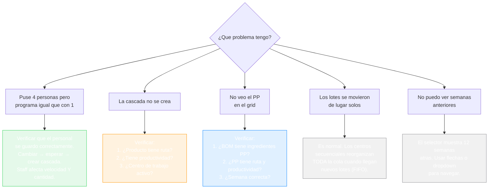

---

## Resumen Visual del Proceso Completo

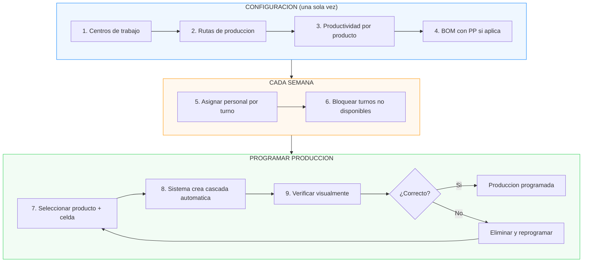

---

## Glosario

| Termino | Significado |
|---------|-------------|
| **PT** | Producto Terminado — el producto final que se vende |
| **PP** | Producto en Proceso — materia prima que se produce internamente |
| **WC** | Work Center / Centro de Trabajo — maquina o estacion |
| **UPH** | Units Per Hour — unidades que produce un WC por hora |
| **Lote minimo** | Tamano minimo de un lote de produccion |
| **Cascada** | Programacion automatica a traves de todos los WC |
| **Forward** | Cascada hacia adelante (PT: WC1 → WC2 → WC3) |
| **Backward** | Cascada hacia atras (PP: se calcula desde el PT) |
| **T1 / T2 / T3** | Turnos: Nocturno (22-06), Manana (06-14), Tarde (14-22) |
| **FIFO** | First In, First Out — los lotes se procesan en orden de llegada |
| **Bloqueo** | Turno marcado como no disponible para produccion |
| **Staffing** | Cantidad de personas asignadas a un WC por turno |
| **BOM** | Bill of Materials — lista de ingredientes/materias primas |
| **Tiempo de reposo** | Pausa obligatoria entre operaciones (ej: fermentacion) |
| **Tiempo fijo** | Operacion cuya duracion NO depende del personal |
